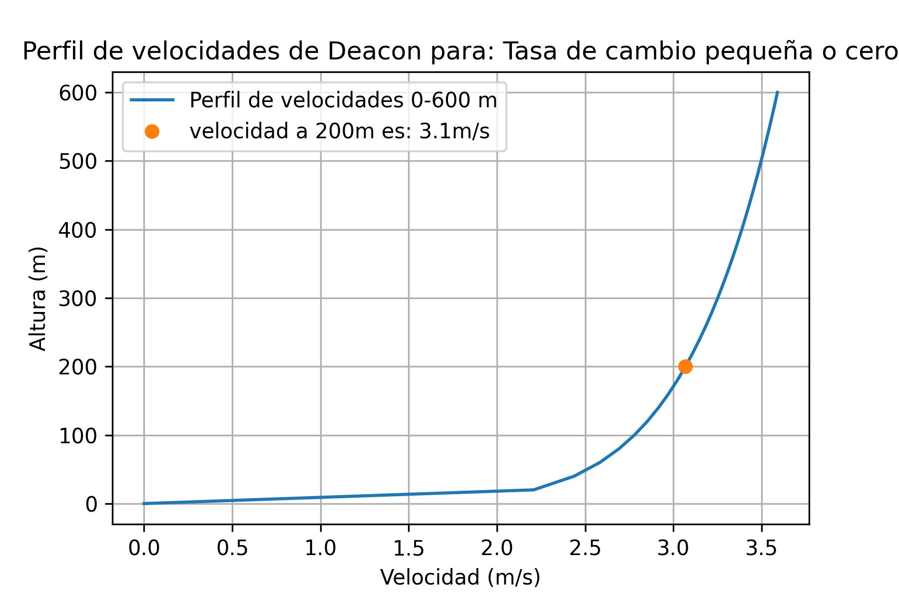

# Control Contaminacion Aire
Este repositorio contiene scripts de Python para el análisis de contaminantes en la atmosfera.

## Introducción
Estos scripts muestran algunos de los ejercicios que dejo a mis alumnos de la **Maestria en Ciencias en Ingenieria Ambiental** del **Instituto Tecnologico de Aguascalientes** en la materia de *Control de la Contaminación Atmosferica*. Los proyectos se basan en temas que se abordan en el libro de *Keneth Wark, Cecil F. Warner - Contaminación del Aire*. La lista de proyectos con una breve descripcion se muesta a continuación. La lista de proyectos se presenta a continuación:

### Lista de los scripts y descripción:
* Proyecto1: Este script evalua la estabilidad atmosferica a partir las temperaturas a diferentes niveles.
* Proyecto2: Script para determinar la temperatura potencial a partir de la presión y la temperatura (solo hay que mandar a imprimir las variables theta_1 y theta_2).
* Proyecto3: Determinación de gradiente potecial de temperatura a partir de dos condiciones de temperatura a dos diferentes niveles del suelo (los resultados aparecen impresos en la consola).
* Proyecto4: Determinación de perfil de velocidades a partir de la ley de pontencia de Deacon (Figura 1).
* Proyecto5: Scritp para determinar la altura de la mezcla a partir del gradiente de temperaturas ambiental y adiabatico a difentes alturas.
* Proyecto5: Script para determinar altura, temperatura potencial y gradiente ambiental de temperaturas a partir de condiciones de P y T (proyecto incompleto).
* Proyecto6: Script para evaluar el modelo de emisión guassiana, a partir de condiciones de estabilidad y parametros atmosfericos.

## Comentarios
Algunos de los codigos necesitan que tengas instaladas las librerias de Numpy y Matplotlib
